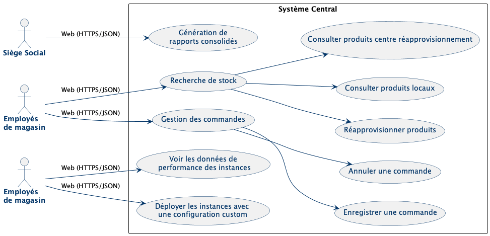
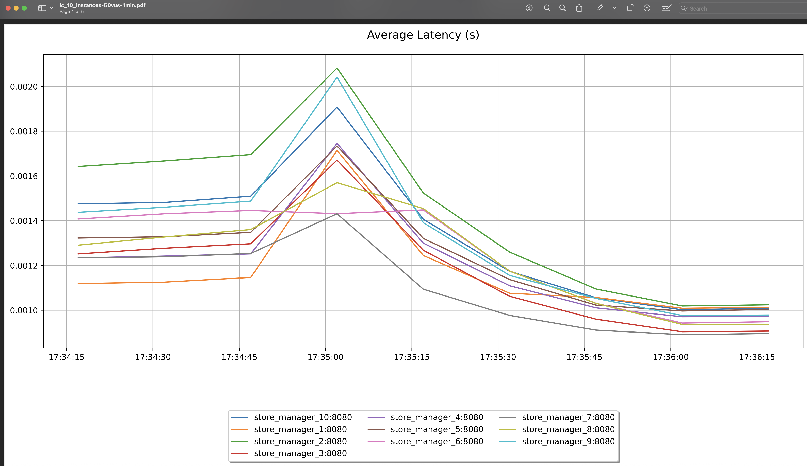
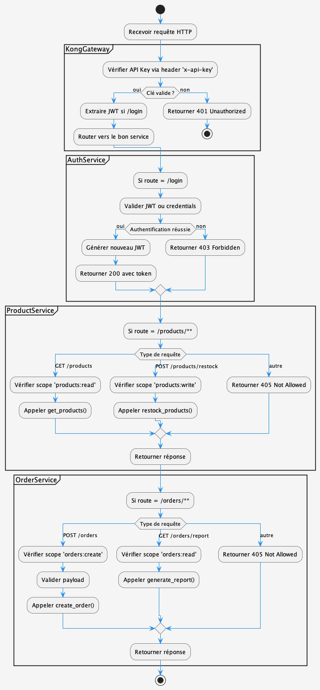

# Liens du repo Github :

- https://github.com/ErwanDerrien/GestionnaireMagasin

Les versions 3, 4 et 5 du projet sont toutes disponibles en regardant les tags.

# 1. Introduction et buts

L'étape 2 du travail de session a pour but d'améliorer le travail de l'étape 1 en implémentant une API.

Le but du travail de session est de concevoir un système de gestion de magasin.

Les objectifs clés incluent :

- Implémenter une API rest (Lab3)
- Implémenter un load balancer (Lab4)
- Implémenter une API gateway (Lab5)

## 1.1 Objectifs de Qualité

### Top 3 Qualités

1. **Cohérence des données** :

   - Synchronisation des données au travers de la chaine. de magasins
   - Mécanisme de résolution de conflits

2. **Évolutivité** :

   - Support pour extensions futures

3. **Transférabilité** :
   - Les interfaces ne doivent pas pas dépendre du système d'exploitation pour être mises en marche

## 1.2 Parties Prenantes

| Rôle                | Préoccupations Majeures            |
| ------------------- | ---------------------------------- |
| Hauts dirigeants    | Exactitude des rapports financiers |
| Employés de magasin | Simplicité d'interface             |
| Équipe DevOps       | Facilité de déploiement            |
| Gestionnaires       | Utilité du centre logistique       |

### Attentes Techniques

- Documentation API
- Load tests
- CI/CD avec validation

# 2. Contraintes Architecturales

- **VM imposée** : L'infrastructure doit fonctionner sur la machine virtuelle fournie
- **Docker obligatoire** : Conteneurisation requise pour tous les composants
- **Modèle 4+1 UML** : Production des vues architecturales exigée
- **ADR requis** : Documentation des décisions architecturales obligatoire
- **CI/CD imposée** : Pipeline GitLab existante à utiliser
- **Budget limité** : Solutions open-source uniquement, pas de services cloud payants
- **Conventions de code** :
  - Français pour le domaine métier
  - Anglais pour le code technique

# 3. Contexte et Périmètre

## 3.1 Contexte Métier

**Système Central**:

- Gestion des stocks multi-magasins
- Génération de rapports consolidés
- Tableaux de bord de performance

**Partenaires Métier**:

| Acteur              | Interactions                    |
| ------------------- | ------------------------------- |
| Employés de magasin | Demandes de réapprovisionnement |
| Employés de magasin | Saisie des ventes               |
| Employés de magasin | Recherch de produits            |
| Siège Social        | Consultation des rapports       |

Format/Protocole : Interface graphique web

<!-- TODO update -->



## 3.2 Contexte Technique

**Stock**:

- Synchronisation via API Rest
- Base de données SQLite centrale

**Contraintes d'Intégration**:

- Doit coexister avec l'infrastructure CI/CD implémentée durant le lab 1
- Doit le système doit rouler sur un docker container


# 4. Stratégie de Solution

## Décisions Fondamentales

**1. Architecture Controller + Services + DAO**

- _Pourquoi_ : Découple les différents éléments du système pour les rendre indépendents des un des autres et donc facile à refactorer
- _Implémentation_ :

**2. Synchronisation par Événements**

- _Pourquoi_ : Atteindre la cohérence des données entre magasins
- _Avantage_ : Nécessite seuelement de mettre à jour les informations sur la BD, pas d'avertir les autres éléments du système.

**3. Découpage Microservices**

- _Services_ :
  - Gestion-Stock (Spring Boot)
  - Reporting (Quarkus pour performance)
- _Avantage_ : Évolutivité indépendante

## Qualités Clés Adressées

| Qualité         | Scénario                         | Solution                                            |
| --------------- | -------------------------------- | --------------------------------------------------- |
| **Cohérence**   | Sync stocks instantané           | Toutes transactions refletées directement sur la BD |
| **Évolutivité** | Ajout magasin en moins d'un jour | API versionnée + contrat Swagger                    |

## Choix Technologiques

- **Backend** :

  - API Gateway : Kong
  - Python, API sur serveur Flask
  - Base de données : SQLite

- **DevOps** :
  - CI/CD : GitLab Pipelines

# 5. Vue des Blocs de Construction

## 5.1 Vue Niveau 1 (Système Global)


**Composants principaux** :

| Bloc               | Responsabilités                       | Interfaces              |
| ------------------ | ------------------------------------- | ----------------------- |
| Site Web           | Interface utilisateur                 | HTTP vers API Gateway   |
| Kong (API Gateway) | Routage, authentification, throttling | REST/HTTP               |
| Services Flask     | Logique métier                        | API interne (gRPC/HTTP) |
| SQLite             | Persistence des données               | ORM (SQLAlchemy/Peewee) |

**Relations** :

- Toute communication externe passe par le gateway Kong avant d'atteindre les services Flask
- Le gateway orchestre le load balancing entre les instances Flask
- Les services Flask accèdent directement à la base SQLite via ORM
- Le site web communique exclusivement avec le gateway (port 80/443)

**Contraintes techniques** :

- Isolation Docker complète (aucun accès direct aux services Flask depuis l'extérieur)
- Les serveurs Flask implémente :
  - Cache Redis
  - Logging Prometheus
  - Authentification JWT

## 5.2 Vue Niveau 2 (Détail Docker container)


**Structure interne du conteneur Flask** :

1. **Couche Contrôleur**

   - Gestion des requêtes HTTP/REST (port 8080)
   - Validation des entrées utilisateur

2. **Couche Service**

   - Logique métier (recherche produits, gestion commandes)
   - Contrôle des transactions

3. **Couche Modèle/DAO**
   - Mapping objet-relationnel (SQLAlchemy)
   - Abstraction SQLite/MySQL

**Principes clés** :

- Architecture 3-tiers stricte (Controller → Service → DAO)
- Isolation Docker complète (ports exposés : 8080 uniquement)
- Injection de dépendances entre couches

# 6. Vue de runtime

## UC1 et UC3 - Génération et visualistion de rapport


## UC2 – Consulter le stock central et déclencher un réapprovisionnement


## Sauvegarder une commande


# 7. Vue de déploiement


### Nœuds

| Nœud                  | Description                                                  |
| --------------------- | ------------------------------------------------------------ |
| **Caisse**            | Poste client pour les caissiers, accès via l’interface Web.  |
| **Ordinateur**        | Accès Web des gestionnaires et dirigeants.                   |
| **Site Web**          | Interface Web sécurisée, point d’entrée utilisateur.         |
| **Kong Gateway**      | API Gateway assurant le routage et la sécurité des requêtes. |
| **Auth Service**      | Gère l’authentification et les utilisateurs.                 |
| **Order Service**     | Gère les commandes, utilise PostgreSQL et Redis.             |
| **Product Service**   | Gère les produits, utilise PostgreSQL et Redis.              |
| **Reporting Service** | Génère des rapports, communique avec PostgreSQL.             |
| **PostgreSQL**        | Base de données relationnelle principale.                    |
| **Redis**             | Stockage temporaire pour cache et paniers.                   |
| **Prometheus**        | Collecte de métriques pour le monitoring.                    |

## Description

Les utilisateurs accèdent au site Web via HTTPS. Celui-ci appelle les services via Kong Gateway.  
Les microservices sont conteneurisés (Docker) et accèdent à PostgreSQL et Redis.  
Prometheus collecte les métriques de Kong et des services.

## Prérequis

- **Client** : Navigateur Web moderne, HTTPS.
- **Serveur** : Environnement Docker avec les services, PostgreSQL, Redis et Prometheus.

# 8. Concepts transversaux

## 8.1 Sécurité

- Authentification JWT via Kong Gateway
- Chiffrement TLS pour toutes les communications
- RBAC avec rôles : Caissier/Gestionnaire/Admin
- Protection contre les attaques (XSS, SQLi)

## 8.2 Architecture API

- Versioning des endpoints (`/api/v2/...`)
- Cache HTTP avec Redis
- Documentation Swagger auto-générée

## 8.3 Validation

- Double validation :
  1. Schémas JSON (FastAPI/Pydantic)
  2. Règles métier dans les services
- Messages d'erreur standardisés

## 8.4 Conteneurisation

- Services découpés en microcontainers
- Orchestration avec Docker Compose
- Variables d'environnement sécurisées
- Health checks intégrés

## 8.5 Monitoring

- Métriques temps-réel (Prometheus)
- Logs centralisés (Fluentd)
- Dashboard Grafana unifié

# 9. Décision d'architecture

## ADR 1 - Architecture monolithique modulaire avec instances dédiées

### Statut

Implémenté

### Contexte

Dans l'évolution du système vers une architecture distribuée, nous avons envisagé deux options :

1. Découper complètement les API par service (Auth, Orders, Products)
2. Garder une structure monolithique modulaire mais avec des instances Docker dédiées

Le système nécessitait :

- Une cohérence forte des règles métiers
- Une maintenance simplifiée des validations communes
- Un déploiement scalable tout en conservant une logique unifiée

### Décision

Nous avons choisi de conserver une API complète dans chaque instance, mais de spécialiser les instances par service via :

- Un routing centralisé par Kong Gateway (`/auth`, `/orders`, `/products`)
- La même base de code déployée dans tous les containers

## ADR 2 - Choix de Kong comme API Gateway

### Statut

Implémenté

### Contexte

Avec la nécessité de gérer :

- 4 services (auth, product, order, other)
- Jusqu'à N instances par service (configurable)
- Plusieurs algorithmes de load balancing
- Un système d'authentification unifié

Nous devions choisir une solution pour :

1. Router le trafic vers les bonnes instances
2. Gérer le load balancing dynamique
3. Centraliser l'authentification

### Décision

Nous avons choisi Kong pour :

**Configuration dynamique** :

```bash
configure_kong_service() {
  # Création des upstreams avec algorithmes variables
  curl -X POST http://localhost:8001/upstreams \
    -d "name=${service}-upstream" \
    -d "algorithm=${algorithm}"  # rr/lc/hash

  # Ajout dynamique des targets
  for i in $(seq 1 $count); do
    curl -X POST /upstreams/${service}-upstream/targets \
      -d "target=${service}_instance_$i:${port}"
  done
}
```

**Avantages clés** :

- Configuration via API REST (intégrable dans nos scripts)
- Support natif des algorithmes de load balancing
- Plugins JWT et Prometheus prêts à l'emploi
- Health checks automatiques

### Conséquences

**Implémentation actuelle** :

- Un seul point d'entrée (`:80`)
- Routes dédiées par service (`/auth`, `/products`, etc.)
- Monitoring unifié via `/metrics`

**Exemple de déploiement** :

```bash
# Déploiement avec 2 instances auth et 3 products
./deploy.sh --auth 2 rr --products 3 lc
```

**Bénéfices observés** :

- Scaling horizontal transparent
- Zero-downtime lors des déploiements
- Métriques consolidées

**Limitations** :

- Nécessite PostgreSQL pour stocker la config
- Courbe d'apprentissage pour l'API Admin

# 10. Exigences de qualité

Cette section rassemble les exigences de qualité applicables au système. Les exigences critiques sont listées à la section [1.2 Objectifs de Qualité](#12-objectifs-de-qualité). Les autres scénarios améliorent la robustesse, la maintenabilité ou l’expérience utilisateur, sans être bloquants.

## 10.1 Référence aux objectifs de qualité principaux

Voir section [1.2 Objectifs de Qualité](#12-objectifs-de-qualité) pour les priorités :

- **Cohérence des données**

  - Synchronisation des stocks entre magasins
  - Gestion des écritures concurrentes

- **Évolutivité**

  - Intégration rapide d’un nouveau magasin
  - Anticipation des futures fonctionnalités

- **Transférabilité**
  - Interfaces multiplateformes
  - Déploiement standardisé (Docker)

## 10.2 Scénarios de qualité secondaires

| ID     | Description                                                                                      |
| ------ | ------------------------------------------------------------------------------------------------ |
| 10.2.1 | Le site Web doit rester utilisable sur une connexion lente ou instable.                          |
| 10.2.2 | L’ajout d’une fonctionnalité ne doit pas nécessiter de modification du service `Stock`.          |
| 10.2.3 | La base de données doit supporter 10 utilisateurs simultanés sans ralentissement notable.        |
| 10.2.4 | Le backend doit atteindre 80 % de couverture de tests unitaires automatisés.                     |
| 10.2.5 | Le système doit fonctionner sans dépendre de services externes non inclus dans l’infrastructure. |

# 11. Risques et Dette Technique

## 11.1 Risques Techniques

| Priorité | Risque                      | Impact                                | Solution Proposée                            | Statut    |
| -------- | --------------------------- | ------------------------------------- | -------------------------------------------- | --------- |
| **1**    | Monolithisation progressive | Perte de scalabilité                  | Découplage en microservices dès que possible | Surveillé |
| **2**    | Performance SQL             | Ralentissement avec ajout de magasins | Indexation + requêtes optimisées             | En cours  |
| **3**    | Dépendance VM               | Difficulté de migration vers le cloud | Passage complet à Docker                     | Mitigé    |

## 11.2 Dette Technique

| Composant       | Dette                          | Conséquence           | Plan de Remédiation          |
| --------------- | ------------------------------ | --------------------- | ---------------------------- |
| Synchronisation | Polling au lieu d’événements   | Latence élevée        | Intégration de RabbitMQ      |
| Tests           | Couverture partielle seulement | Risques de régression | Ajout de tests d’intégration |

## 11.3 Risques Métier

| Probabilité | Risque                         | Impact                 | Atténuation                  |
| ----------- | ------------------------------ | ---------------------- | ---------------------------- |
| Élevée      | Changement des besoins métiers | Refonte partielle      | Modularité de l’architecture |
| Moyenne     | Concurrence de solutions SaaS  | Obsolescence           | Ciblage local + intégration  |
| Faible      | Évolution réglementaire        | Urgence de mise à jour | Veille active                |

**Stratégie** :

- Revue trimestrielle des risques
- Budget pour la dette critique
- Priorisation selon impact/coût

# 12. Glossaire

## Termes Métiers

| Terme                   | Définition                                             |
| ----------------------- | ------------------------------------------------------ |
| **Magasin**             | Point de vente physique                                |
| **Siège Social**        | Centre administratif supervisant les magasins          |
| **Réapprovisionnement** | Commande de stock auprès du centre logistique          |
| **UC (Cas d’Usage)**    | Scénario fonctionnel clé (ex: UC1 = Rapport consolidé) |
| **KPI**                 | Indicateur de performance (Key Performance Indicator)  |

## Termes Techniques

| Terme          | Définition                                                    |
| -------------- | ------------------------------------------------------------- |
| **VM**         | Machine virtuelle                                             |
| **CI/CD**      | Intégration et déploiement continus                           |
| **JWT**        | JSON Web Token (authentification sécurisée)                   |
| **ORM**        | Outil de mapping entre objets et base de données              |
| **WebSockets** | Communication bidirectionnelle en temps réel                  |
| **ADR**        | Architectural Decision Record (décision technique documentée) |

## Acronymes

| Acronyme | Signification                                                                 |
| -------- | ----------------------------------------------------------------------------- |
| **API**  | Application Programming Interface                                             |
| **DAO**  | Data Access Object                                                            |
| **DDD**  | Domain-Driven Design                                                          |
| **MVC**  | Modèle-Vue-Contrôleur                                                         |
| **ACID** | Propriétés des transactions SQL : Atomicité, Cohérence, Isolation, Durabilité |
| **VUS**  | Virtual Users                                                                 |

## Technologies

| Technologie   | Usage                            |
| ------------- | -------------------------------- |
| **MySQL**     | Base de données relationnelle    |
| **Python**    | Langage backend principal        |
| **Vue.js**    | Interface Web                    |
| **Docker**    | Conteneurisation et déploiement  |
| **RabbitMQ**  | Communication entre services     |
| **GitLab CI** | Pipelines d’intégration continue |

## Composants Système

| Composant            | Description                                   |
| -------------------- | --------------------------------------------- |
| **Service Stock**    | Gestion des inventaires                       |
| **DAO**              | Couche d’accès aux données                    |
| **Tableau de bord**  | Visualisation des indicateurs (KPI)           |
| **API REST**         | Point d’entrée pour les intégrations externes |
| **Conteneur Docker** | Unité isolée pour l’exécution d’un composant  |

# 12. Analyse des load tests

Dans le cadre du lab 4 et du lab 5, des tests de load ont été faits pour avoir des données sur les changements qu'auraient un load balancer puis une API gateway.

Pour effectuer ces tests, une multitude de scripts ont été écrits pour tester extensivement les configurations.

- `./monitoring/run_all_tests.sh`
- `./monitoring/automate_load_tests.sh`
- `./monitoring/generate_prometheus_graphs.sh`
- `./monitoring/load_test.sh`

**Tous les résultats de tests automatiques sont documentées sous forme de pdf dans `documentation/monitoring`.** Dans ces pds, ont peut retrouver l'information suivante pour chacune des configurations :

- Requests per second
- Memory (mb)
- CPU (%)
- Average latency (s)
- Error rate (%)

Dans les sections qui suivent, seulement quelques éléments sont analysés pour le rapport dans le but de souligner les différences majeures entre les versions.

## Tests avant implémentations


## Tests après load balancer

Pour le laboratoire 4, nous avons implémenté un système de load balancer avec nginx. Avec les scripts créés, il a été facile d'implémenter le testage de configurations spéciales.

Les configurations testées sont :

- Round Robin
- Round Robin Least Conn
- Weighted
- Hash

Le script `run_all_tests.sh` permet de tester chaque configuration, avec 1, 5, 10 et 15 instances de serveur. Pour tous les nombres d'instances de serveur, 3 tests ont été faits avec un nombres d'utilisateurs simulés dans les tests. Chaque config a été testée avec 1 virtual user (VUS), puis 10 puis 50.

Initialement à cause d'une configuration incomplète, il a été possible d'observer comment le système gère les pannes d'instances. En cas de panne, il a été observé que les instances qui étaient bien démarrées avaient bien pris la relève. Les données récoltées n'ont pas été sauvegardée, et actuellement nous avons une version stable avec laquelle il n'est pas facilement possible de retester cette mise en situation.

Une chose intéressante observée est que le nombre d'utilisateur simultanné à un grand impact sur la latence. Dans le premier graph on peut voir comment la latence moyenne augmente, et dans le deuxième graphique, comment après un spike le temps d'attente diminue drastiquement. La seule chose qui différencie les deux graphiques est le nombre d'utilisateur simultanés.




## Tests après API gateway

Pour les tests d'api gateway, 16 configurations différentes ont été testées. Une chose observée dans les tests est la baisse de latence générale lorsque tous les services ont beaucoup d'instances comparé à une confique concentrée sur un endpoint spécifique.


Aussi pour comparer aux données prélevées sur grafana, on peut voir comment les différentes config affectent la quantité de resources utilisés par le CPU. Comparé à avant l'implémentation d'un load balancer et d'un api gateway, on peut voir que l'utilisatilon de cpu est grandement diminué.


Spécifiquement dans la configuration avec un accent sur un service, on peut voir que l'utilisation de cpu est encore plus basse.


# 13. Diagrammes restants





